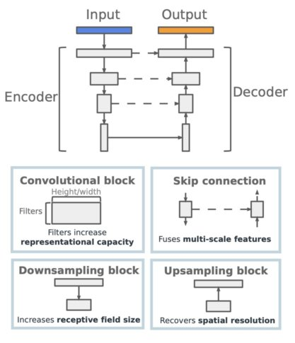
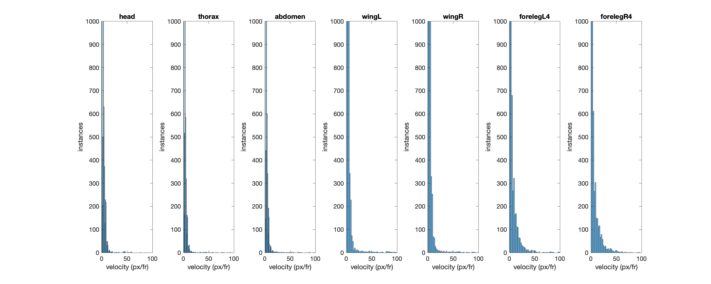

# pose estimation:
- Encoder-decoder CNN-based approaches to inference of body nodes and connectivity-based identity tracking
- Example analysis of drosophila in close social contact, kinetics, and spatial relationships
- Custom pipeline for parallelization, visualization, statistical validation, and auto-sourcing examples, resulting in >10x efficiency in model development, improved overall performance (from 80% to >98% accuracy), and 3-4x reduction in training set examples
- Systematic model development as above, blending of top-down and bottom-up models, and other innovations enabled markerless tracking and identity disambiguation of occluded key nodes (e.g. nose)
  - resulted in robust model performance in most interesting but difficult-to-parse social situations, e.g. aggression, sniffing, sudden change of direction
  - improved performance of nose-to-nose dropped events from 30% to < 5% - which is the difference between useable and not useable
- Generalized to different tasks, angles, image qualities and robust to some (but not all) occlusions, e.g. experimenter, small implanted devices
- Enabled high-resolution (both spatial and temporal) analysis of behavioral dynamics and neural-behavioral relationships of mice in dynamic social interaction (when paired with miniscope calcium imaging of neuronal activity; manuscript in preparation)

## architecture used:

Figure from Pereira et al., 2020

## pipeline for validation, visualization, and sourcing of key training examples:
1. use main_validation_pipeline.m to start
2. play with sample datafiles in '/drosophila'
3. various auxiliary functions are distributed depending on class
4. generates plots of spatial statistics
5. optional re-labeling of low confidence values via interpolation or other methods
6. generate re-annotated videos for visualization of key mistakes
7. generate heatmaps and trail plots for visualization
8. visualize, identify statistical outliers, identify key error frames, and re-label recommended training examples for recalibrating training set

## example inferenced videos:
The model performs well even with highly dynamic social behaviors such as aggression. Accuracy of predicted labels outside certain criteria are selectively annotated for targeted review. 
 
 

 
 
Here auto-sourcing identifies a key behavioral motif in rearing on which the model struggles, which was previously unappreciated in the training set. This is re-labeled with nearby high-confidence values or a different model more suited to this situation. This can then be re-added to the training set for the next training iteration. Hence, re-integration of key training examples can be continuous and each example added provides more value with less labeling time. 

## example analysis tools:
Examples of tools to define statistical criteria for quality control, and to visualize spatial heatmaps of multiple agents across time. 

## acknowledgements:
- Kingsbury et al., 2019, 2020; Wu et al., 2021
- sleap: Pereira et al., 2020 (sleap.ai)
- deepposekit: Graving et al., 2019 (deeposekit.org)
- Burgos-Artizzu, et al., 2021
- repnan: www.ig.utexas.edu/people/students/cgreene/
- printStruct
- avi2gif (Lindner)
